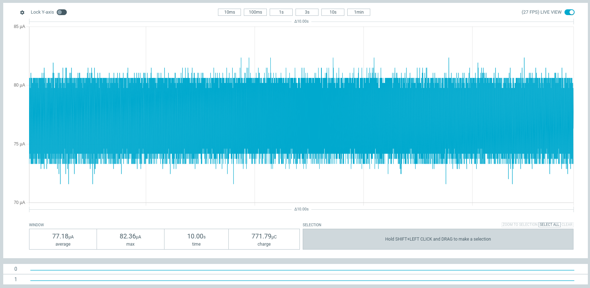
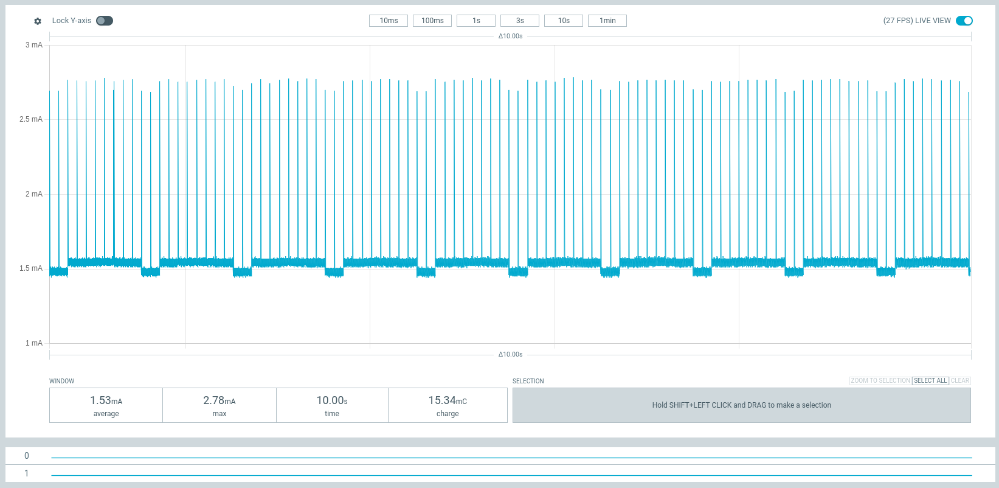
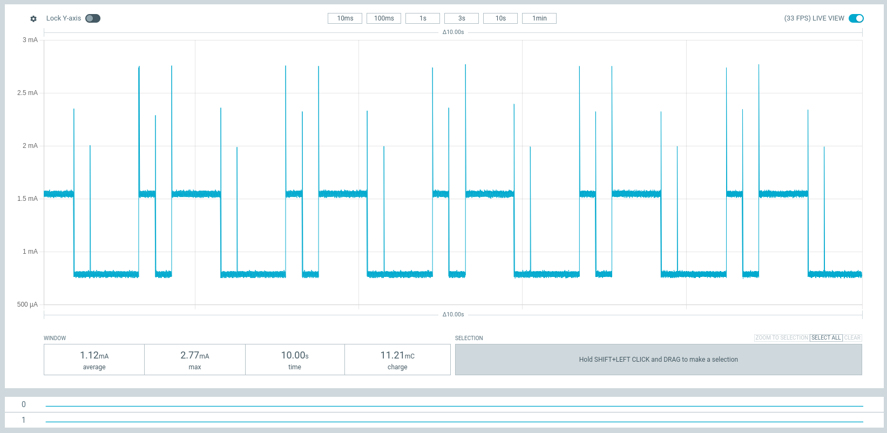
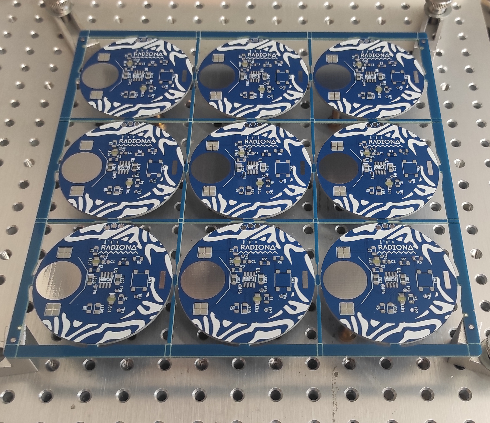
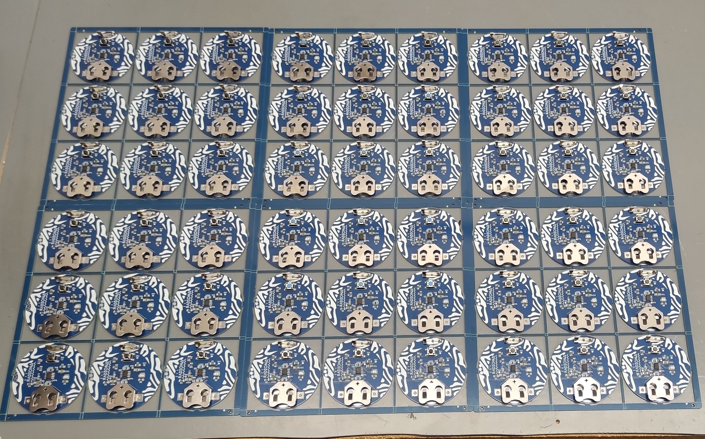

# RadionaOrg badge for DEEP security conference

## DEEP badge CTF

First 3 LEDs are showing welcoming text messages in Morse code.

LED4 is holding KEY for decrypting LED5 message.

Send us your name/nick and solution to: social@intergalaktik.eu

And we will add you to Badge solvers in this readme...

### Badge sleep

Hold button for ~5s until you see all leds on, release button and badge will go to sleep.

In sleep mode badge will consume around 80uA.

To go out of sleep just press button again.

The badge will reboot so you will need to wait for 4s to get raider again.

If you will not use badge for long period it is best to remove battery.

### Badge Power ON

Put battery and you will see one LED slightly ON.

There is 4 second programming delay, please wait 4 seconds and badge will start doing LED RAIDER.

In this mode badge consumes around 1.6mA.

### Modes

This badge has 7 cases, 5 are morse code one is raider and one is sleep mode.

On button press you are moving to next case.

Press the button and wait for next mode to start.

### Morse 

It is human readable, but you can also use app, or write your own.

Each LED has it's own message.

In this mode badge consumes around 1.2mA.

### Assembly

Badge was done as as 3x3 panel.

Soldering paste was applied.

P&P machine was used to place only resistors, as that was fastest way to do it.

All other components except 4 LEDs that show from back to front are placed by hand. 

Boards ware then soldered in soldering oven.

4 LEDs are then placed with hand and hand soldered as they need to be upside down.

Code with task was written and loaded into the badge.

### Code

Platformio project that you can use is here: https://github.com/RadionaOrg/ZigZag/tree/main/SOFTWARE/PlatformIO/deep

To make your custom code - open this folder in vscode, setup Platformio, and build...

To show your own messages you need to make changes here:

https://github.com/RadionaOrg/ZigZag/blob/main/SOFTWARE/PlatformIO/deep/src/main.c#L499

For a programmer we are using WCH-LinkE - but there are projects that are using RP2040 or ESP32 as loader...

https://www.olimex.com/Products/RISC-V/WCH/WCH-LinkE/

## Thank you!

Thank's for playing! We hope you like it!

## Licensee
* Software is released under GPL V3 Licensee
* Documentation is released under CC BY-SA 4.0

Big thanks to Olimex for all RVPC code examples...

### Badge solvers

28.10.2025. - minime
